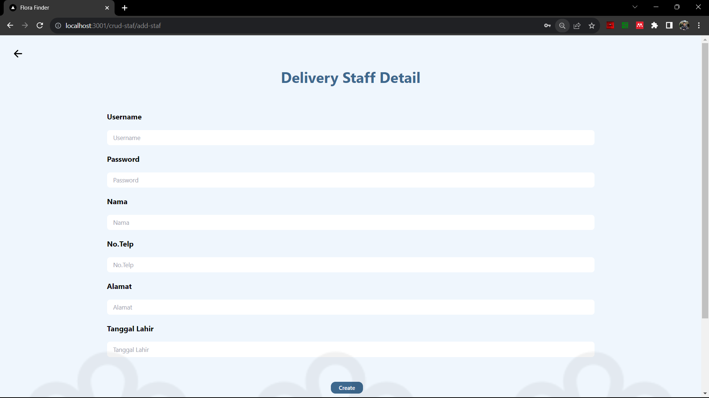

This is a [Next.js](https://nextjs.org/) project bootstrapped with [`create-next-app`](https://github.com/vercel/next.js/tree/canary/packages/create-next-app).
## Apa Itu Flora Finder ?
Flora Finder adalah sebuah dashboard yang dirancang khusus untuk mengembangkan efisiensi dan transparansi dalam seluruh proses pengiriman bunga. Dengan tujuan tersebut, diharapkan setiap pengiriman berjalan dengan optimal, efisien, dan dapat terus terlacak secara akurat. Sistem ini disesuaikan untuk dua kelompok pengguna utama, yaitu manajer operasional yang memiliki kendali atas pengelolaan staf pengiriman, serta staf pengiriman yang bertugas untuk mengantarkan bunga kepada pelanggan. 

## Getting Started

Pertama-tama, run development server:

```bash
npm run dev
# or
yarn dev
# or
pnpm dev
# or
bun dev
```

Buka [http://localhost:3000](http://localhost:3000) dengan browser anda untuk melihat aplikasi Flora Finder.

## Daftar Use Case dan Penangggung Jawab


## Daftar Layar-Layar Aplikasi Flora Finder
### Layar Manajer Operasional
#### 1. Halaman Login 1

#### 2. Halaman Login 2

#### 3. Halaman Login 3

#### 4. Halaman List Packages

#### 5. Halaman Delivered Packages

#### 6. Halaman Check Laporan Packages

#### 7. Halaman Detail Package

#### 8. Halaman Not Assigned Package

#### 9. Halaman Assign Package to Staff

#### 10. Halaman Staff List

#### 11. Halaman Edit Staff

#### 12. Halaman Create Staff

#### 13. Halaman Notifikasi


### Layar Delivery Staff
#### 1. Halaman Login 1

#### 2. Halaman Login 2

#### 3. Halaman Login 3

#### 4. Halaman List Packages

#### 5. Halaman List Packages (Scrolled)

#### 6. Halaman Change Package Status

#### 7. Halaman Lapor Masalah

#### 8. Halaman Upload Proof Package


## Deploy on Vercel

The easiest way to deploy your Next.js app is to use the [Vercel Platform](https://vercel.com/new?utm_medium=default-template&filter=next.js&utm_source=create-next-app&utm_campaign=create-next-app-readme) from the creators of Next.js.

Check out our [Next.js deployment documentation](https://nextjs.org/docs/deployment) for more details.
